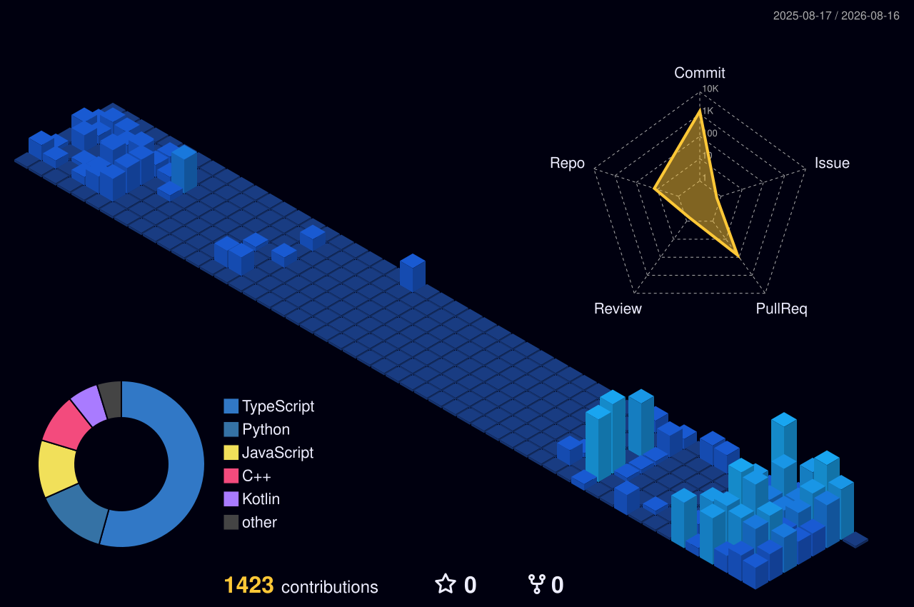

#  Welcome to My Universe

  

  

  
  
  
  

  <i>You can contact me on the contacts above!</i>

---

###  About Me

•⁠  ⁠ I’m currently building and exploring software projects, from web applications to backend systems.

•⁠  ⁠ I’m currently learning *Backend Development*  &nbsp;|&nbsp; *Go*  &nbsp;|&nbsp; *C & C++* 

•⁠  ⁠ I’m looking to collaborate on open-source projects and interesting ideas.

•⁠  ⁠ You can ask me about *anything*

•⁠  ⁠*I love figuring out how things work — such as software architecture to the hardware underneath.*

---

###  Beyond Code

Outside of coding, I enjoy:

•⁠  ⁠ Playing guitar and creating music
•⁠  ⁠ Exploring coffee and cafés
•⁠  ⁠ Playing games
•⁠  ⁠ Working out and running
•⁠  ⁠ Watching movies and series

###  Tech Stack & Tools

  

---

  
  

 

  

 

  

 

  

  <i>"Talk is cheap. Show me the code." - Linus Torvalds</i>

