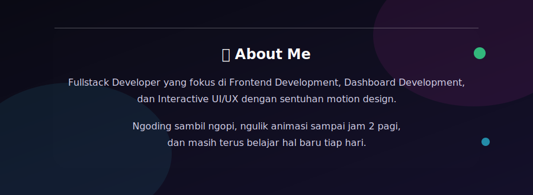
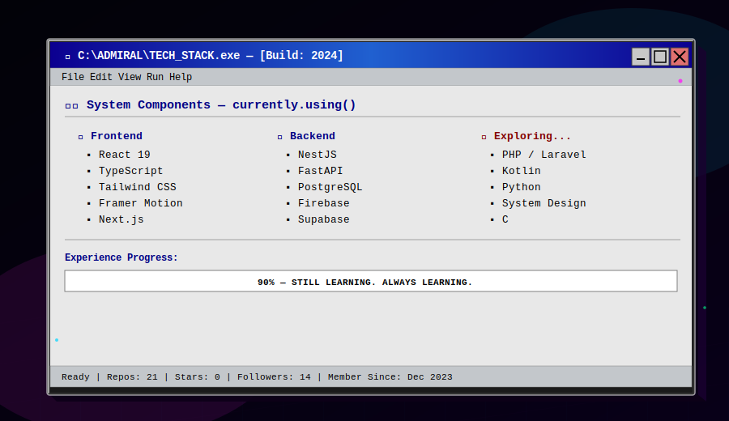
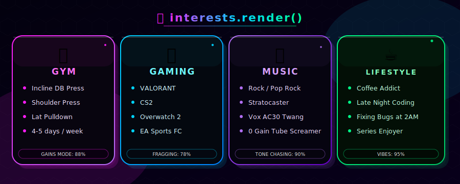

 

 

 

 

  

 

 

<!-- ================= PROJECTS — PINNED REPOS ================= -->

<h2>📦 projects.pinned()</h2>

 
<code>watch-this</code> / <code>sereluna-ai-engine</code> 

 

<!-- ================= STATS — MULTI PROVIDER ================= -->

<h2>📊 github.analytics()</h2>

  

  

  

 
<!-- 
⚠️ kalau ada card yang gak muncul: layanan publik ini (vercel/demolab) sering kena rate-limit atau lagi down bareng-bareng. 
Cek lagi beberapa menit kemudian, atau paling stabil <b>self-host</b> — fork repo providernya & deploy ke Vercel akun sendiri. 
Kalau streak masih 0 padahal udah commit: buka <b>github.com/settings/profile</b> → centang "Include private contributions on my profile".
 -->

 

 

 

