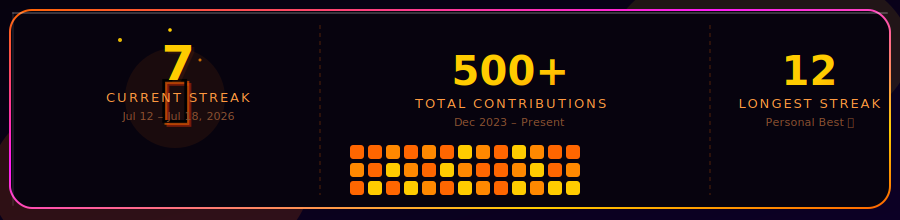

 

 

 

 

  

 

 

<!-- ================= PROJECTS — PINNED REPOS ================= -->
<!-- Auto-updated daily by GitHub Actions -->

 

<!-- ================= STATS — Auto-updated daily via GitHub Actions ================= -->

  

  

  

  

 

 

<!-- Snake contribution grid — Auto-updated daily -->

 

